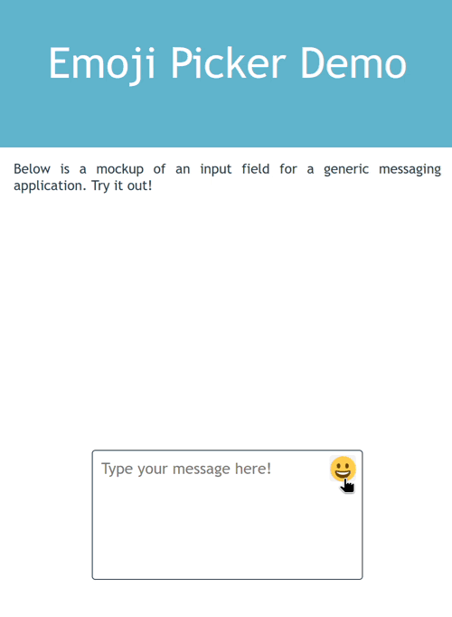

# elm-emoji

_Fork of [elmoji](https://github.com/Holmusk/elmoji)_

Check out the [demo](https://vjousse.github.io/elm-emoji/)!

<p align="center">
  
</p>

This module provides a general-purpose emoji picker written in Elm. In order to integrate this with your application, there are a few things that need to be implemented (check the `examples` directory for a sample).

1. Include a field in your `Model` to hold the picker's submodel:
   ```elm
   import EmojiPicker exposing (Model, PickerConfig, Msg(..), view, update, init)
   type alias Model =
       { text       : String
       , emojiModel : EmojiPicker.Model
       }
   ```
2. Initialize the picker's submodel with a `PickerConfig`:

   ```elm
   pickerConfig : PickerConfig
   pickerConfig =
       { offsetX = -281 -- x position relative to button
       , offsetY = -450 -- y position relative to button
       , closeOnSelect = True -- whether or not to close after an emoji is picked
       , customEmojis =
           -- custom emojis you may want to display
           [ { name = ":ablobattention:"
             , native = ":ablobattention:"
             , sortOrder = 1
             , skinVariations = Dict.fromList []
             , keywords = []
             , imgUrl = Just "https://static.mamot.fr/custom_emojis/images/000/198/601/original/2b89f4eb90c65d6a.png"
             }
           , { name = ":myheart:"
             , native = "❤️"
             , sortOrder = 2
             , skinVariations = Dict.fromList []
             , keywords = []
             , imgUrl = Nothing
             }
           , { name = ":opensource:"
             , native = ":opensource:"
             , sortOrder = 3
             , skinVariations = Dict.fromList []
             , keywords = []
             , imgUrl = Just "https://static.mamot.fr/custom_emojis/images/000/198/609/original/6d1160723cd84c19.png"
             }
           ]
       , customEmojisWidth = Nothing
       , customEmojisHeight = Nothing
       }

   initialModel : Model
   initialModel =
       { text       = ""
       , emojiModel = EmojiPicker.init pickerConfig
       }
   ```

3. Include a constructor in your `Msg` to catch the picker's submessages:

   ```elm
   type Msg
       = NoOp
       ...
       | EmojiMsg EmojiPicker.Msg
       ...
   ```

4. Catch the `Select` submessage in your `update` function (let the rest of the messages be handled by the internal update function):
   ```elm
   update : Msg -> Model -> (Model, Cmd Msg)
   update msg model =
       case msg of
           ...
           EmojiMsg subMsg ->
               case subMsg of
                   EmojiPicker.Select s ->
                       -- "s" is the emoji, add this to your input field
                       ...
           ...
   ```
5. Include a way to toggle the picker's visibility by sending its internal `Toggle` message:
   ```elm
   view : Model -> Html Msg
   view model =
   ...
       button [ onClick <| EmojiMsg EmojiPicker.Toggle ] []
   ...
   ```
6. Include the picker in your `view` function (along with a button or something that sends the `ToggleEmojiPicker` message `onClick`). The picker is styled with the `elm-css` module, which uses an internal replacement for the standard `elm/html` module, so you'll need to `Html.map` it first:
   ```elm
   view : Model -> Html Msg
   view model =
       let
           picker = Html.map (EmojiMsg) <| EmojiPicker.view model.emojiModel
       in
           -- use `picker` somewhere
           ...
   ```

And that's it! If you'd like to change any of the default styles in this module, you can clone the repo and edit the `Styles.elm` file.

## Acknowledgements

The category icons were taken from the [emoji-mart repo](https://github.com/missive/emoji-mart/blob/master/src/svgs/index.js) by Missive, and rewritten in Elm.
The emojis themselves were obtained by parsing the `emoji.json` file on the [emoji-data repo](https://github.com/iamcal/emoji-data).
The keywords were obtained by parsing the `common/annotations/en.xml` file on the [unicode cldr repo](https://github.com/unicode-org/cldr/releases).
